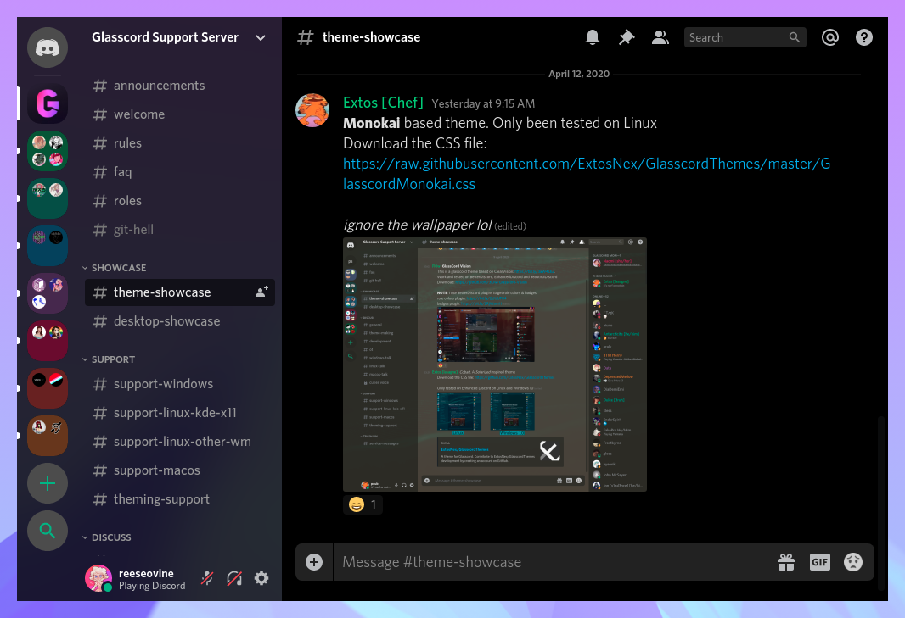
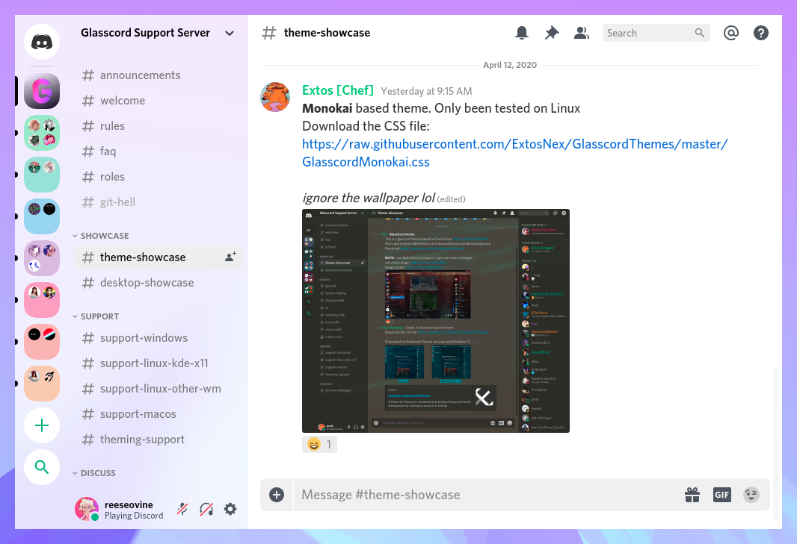

# Discord themes

### How to use

To load custom stylesheets, install [EnhancedDiscord](https://github.com/joe27g/EnhancedDiscord), [BandagedBD](https://github.com/rauenzi/BetterDiscordApp), or [BeautifulDiscord](https://github.com/leovoel/BeautifulDiscord). These themes require [Glasscord](https://github.com/AryToNeX/Glasscord) for optimal appearance.

Only tested on Linux with EnhancedDiscord. Modifying Discord goes against their TOS so *use at your own risk*.

## Bliss

Sleek, flat theme with support for both light and dark modes. Colors can be modified in the `.theme-dark` and `.theme-light` sections.

There is an optional SCSS file you can use to import colors from Pywal which you will need to compile yourself.

[Download](https://raw.githubusercontent.com/katacarbix/discord-themes/master/bliss/bliss.theme.css)

