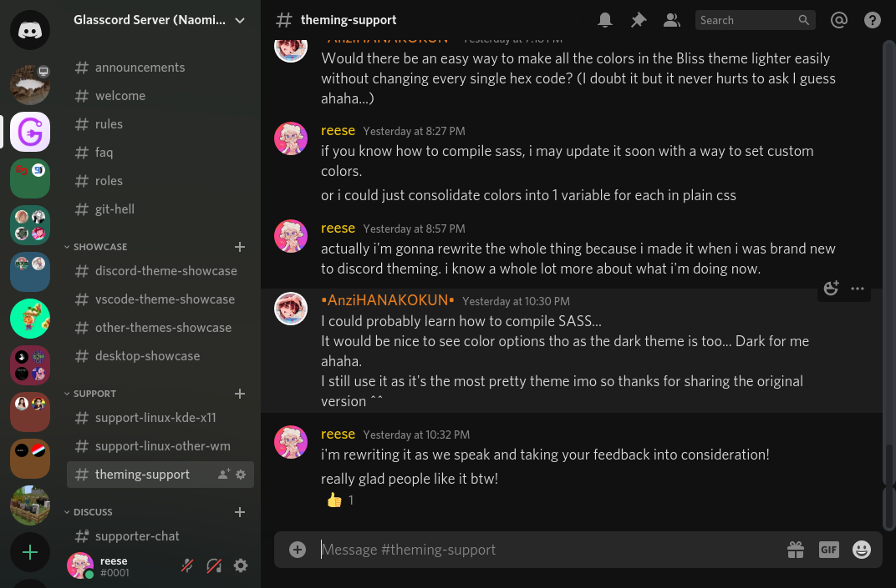
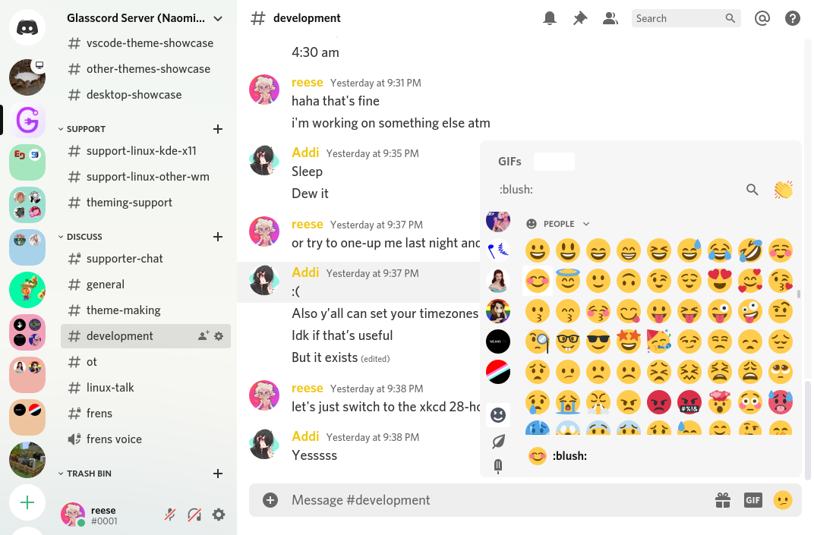

# Stuff that I made for Discord

The plugins were made to be used with [Powercord](https://powercord.dev).

To use custom stylesheets, install Powercord, [BandagedBD](https://github.com/rauenzi/BetterDiscordApp), or [BeautifulDiscord](https://github.com/leovoel/BeautifulDiscord).

Only tested on Linux with Powercord. Modifying Discord goes against their TOS so ***use at your own risk***.

# Plugins

## Lightswitch

A tiny plugin that allows you to set light and dark appearance from the Javascript console. Designed for use with my Pywal setup. I may add slash commands if there is interest.

Usage: (open DevTools with `ctrl+shift+i` and switch to Console)  
```js
Lightswitch.set('light'); // AAAAAH MY EYES!!!
Lightswitch.set('dark'); // much better 😎
```

# Themes

## Bliss

Sleek, flat theme with support for both light and dark modes. Colors can be modified in the `.theme-dark` and `.theme-light` sections. It requires window transparency for optimal appearance.

If you would like to use colors generated by [pywal](https://github.com/dylanaraps/pywal) there is an SCSS file provided which you will need to compile on each update of pywal.

 
